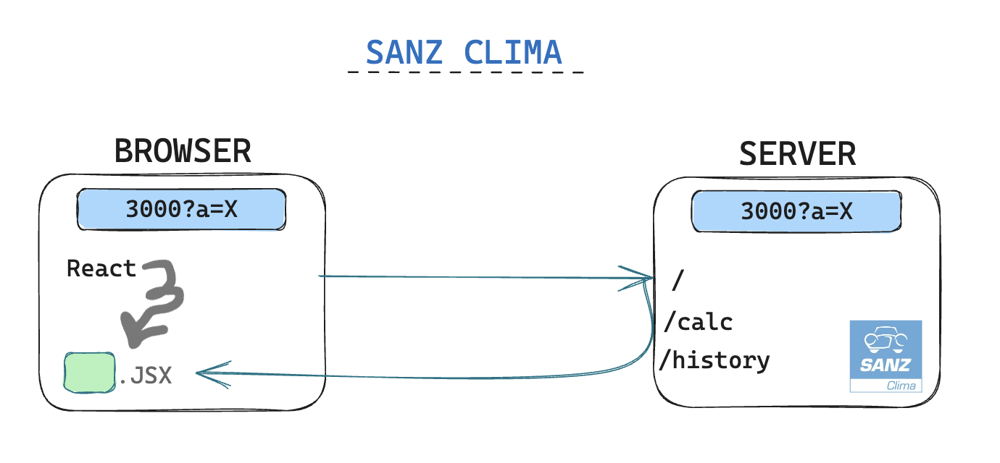

<p align="center" style="margin-center:8%">

</p>

<p align="center" style="margin-center:8%"> If you want to see the project: https://laiaruizm.github.io/SanzClima-full-stack-test
</p>

# SANZ CLIMA | TECHNICAL TEST

- Hi there people! 👋🏻
- My name is Laia Ruiz Martínez and this is **Sanz Clima's full stack test**.

## -- About this project 🙋🏼‍♀️ --

- **In this version both calc and history are a page endpoints, not Ajax endpoints**.
- This project uses **version 13**. The folder `\pages` is the previous way to create app Routes, like endpoints (Example: pages->api->hello.js = it's an endpoint). This has not been migrated to the app folder. To use this version I removed the `\pages` folder and instead I have created the `\app` folder, which is the new way to create routes.
- This is a [Next.js](https://nextjs.org/) project bootstrapped with [`create-next-app`](https://github.com/vercel/next.js/tree/canary/packages/create-next-app).

## -- Table of contents --

- [Overview](#overview)
  - [Links](#links)
  - [Further implementations](#further-implementations)
- [Project's process](#projects-process)
  - [Organization](#organization)
  - [Built with programming languages & tools 🛠️](#built-with)
  - [Setup for getting started](#setup)
- [Author](#author)

## Overview

### Links

- Live code: [https://github.dev/LaiaRuizM/SanzClima-full-stack-test](https://github.dev/LaiaRuizM/SanzClima-full-stack-test)
- Project's website: [https://laiaruizm.github.io/SanzClima-full-stack-test/](https://laiaruizm.github.io/SanzClima-full-stack-test/)

### Further implementations

- In future versions this can be expanded to both be Ajax endpoints and being consumed from a main page.

## Project's process

### Organization

<p align="center" style="margin-center:8%">

</p>

### Built with

- HTML
- CSS
- Next.JS
- React.JS
- VISUAL STUDIO CODE (VSC) 🗄️
- HTML 📌
- CSS 🖌️
- NEXTJS ⚡️
- GIT / GITHUB 📂

### Setup

1. Clone the repo:
   `git clone https://laiaruizm.github.io/SanzClima-full-stack-test`

1. Install NPM packages:
   `npm install`

1. Start the project, run the development server:

```bash
npm run dev
# or
yarn dev
# or
pnpm dev
```

Open [http://localhost:3000](http://localhost:3000) with your browser to see the result.

## Author

💡 If you want to contact me for any suggestion, doubts, contributions, PullRequest. Feel free to ask me if you have any question or curiosity:

- Email: [laia.ruizm@hotmail.com](laia.ruizm@hotmail.com)
- Linkedin: [https://www.linkedin.com/in/laia-ruiz-martínez/](https://www.linkedin.com/in/laia-ruiz-martínez/)
- GitHub: [https://github.com/LaiaRuizM](https://github.com/LaiaRuizM)

«All you need is attitude. Aim for the stars so that if you miss, you will still get to the moon». 🙋🏼‍♀️

Made with 💙 by [Laia](https://github.com/LaiaRuizM)
